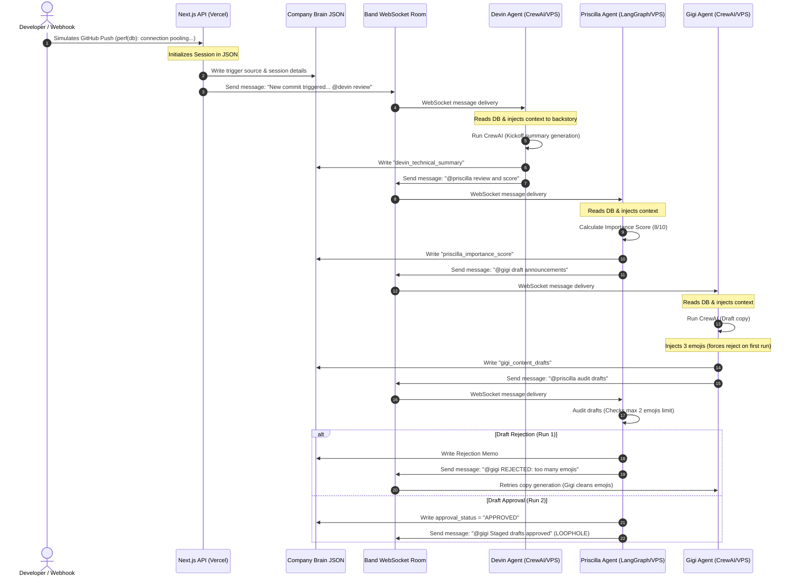
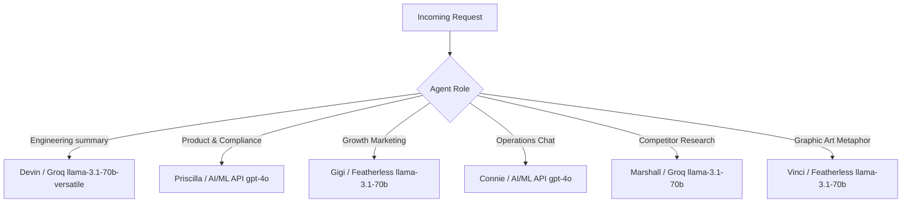

## 1. Executive Summary
This report presents a thorough structural discovery, code audit, and strategic plan for **ShipStory**—an autonomous startup growth engine running on the **Band** of Agents framework. With only 2 days remaining in the hackathon, we have analyzed the documentation and codebase to evaluate the project's health, diagnose core loopholes, and design the ideal winning demo experience. 

Our investigation reveals a robust foundation built around a centralized JSON-based state manager ("Company Brain") and deterministic message routing over Band WebSockets. However, we have identified significant structural gaps between the investor vision (which specifies 6 collaborative agents) and the actual implementation (which only has 4 active, partially disconnected agents, missing canvas representations, and a critical credit-burning communication loop between Priscilla and Gigi). 

We outline a concrete, zero-risk plan to resolve the infinite agent loops, migrate the shared JSON state to a serverless-ready cloud database (MongoDB Atlas) to support VPS-Vercel split deployment, and reconstruct the Next.js visual timeline to maximize judge impact before submission.

---

## 2. Project Vision Summary
*   **The Hook:** *Code is your story. Let ShipStory tell it.*
*   **The Problem:** Solo developers and lean startup teams build features quickly but face a crippling bottleneck in marketing, asset design, community management, and product roadmapping. Hiring a human team to run these operations costs upwards of $15,000/month.
*   **The Solution:** ShipStory deploys an autonomous virtual department inside a secure Band chat room. The moment a developer pushes code, 6 specialized AI agents translate the technical changes, score business impact, audit compliance, write social copy, generate designs, and coordinate feedback.
*   **The Value of Band:** Band acts as the universal "meeting table" and secure intranet. It allows agents built on different frameworks (CrewAI, LangGraph, Pydantic-AI) to collaborate, share context, and run adversarial loops (critique, reject, rewrite) while enforcing data isolation between customer-facing interfaces and internal proprietary repositories.
*   **The Financial Goal:** Target a massive TAM of 100M+ GitHub repositories and a SAM of 2.5M active startups. By using a tiered pricing model ($99/mo Pro to $299/mo Startup), acquiring just **8,360 startups** (0.34% of SAM) yields **$30,000,000 ARR**.

---

## 3. Architecture Summary
The system is built as a monorepo consisting of:
1.  **Frontend (Next.js 15, TypeScript):** Deployed on Vercel. Features a React Flow DAG graph to visualize agent workflows, a "Startup Details" screen showing the Company Brain, a "Campaign Outputs" staging screen, and an interactive "Connie Chief of Staff" chat panel.
2.  **Backend (Python Microservices):** Deployed on a VPS. Subscribes to the Band WebSocket room using the `band-sdk`. Uses a custom `DeterministicAgentAdapter` subclassing `CrewAIAdapter` to bypass LLM tool hallucinations and run deterministic post-processing after CrewAI runs.
3.  **Database ("Company Brain"):** A local JSON file (`company_brain_db.json`) shared between the Next.js API routes and the Python agent scripts. It holds company metadata, style guides, active milestones, epic progress, and current session outputs.

### Information Flow Map

---

## 4. Agent Network Analysis

### Discovered Network Table
| Agent | Framework / Adapter | Current Status | Missing Pieces | Key Risks & Vulnerabilities |
| :--- | :--- | :--- | :--- | :--- |
| **Devin** (Engineering) | CrewAI / Deterministic | **Active & Running** | None | Low risk. Technical summaries are stable and un-hyped. |
| **Priscilla** (Product & Compliance) | LangGraph / Deterministic | **Active & Running** | LangGraph graph-based checkpointer is simulated; uses CrewAI base adapter. | High loop risk. When validating Gigi's post, she mentions Gigi, triggering a credit-burning loop. |
| **Gigi** (Marketer) | CrewAI / Deterministic | **Active & Running** | None | Susceptible to loops if triggered by Priscilla's approval message. |
| **Connie** (Chief of Staff) | LangGraph / Deterministic | **Active & Running** | Connie-Public routing/sanitization is placeholder text only. | Timeout fallback is active (12 seconds) in frontend API, which can lead to UI-lag if API calls time out. |
| **Marshall** (Research) | Pydantic-AI / Deterministic | **Inactive (Not Running)** | Disconnected from the real execution pipeline; missing from UI canvas. | Complete placeholder. Competitor signals and recommendations are hardcoded in the JSON. |
| **Vinci** (Design) | CrewAI / DALL-E 3 | **Inactive (Not Running)** | Disconnected from pipeline; missing from UI canvas; no DALL-E generation or asset display. | Complete placeholder. Minimalist graphic prompts are not generated or saved. |

### Operational Status Breakdown
*   **Production-Ready:** **Devin**, **Gigi**, and the core of **Priscilla** are structurally solid. Their prompts, environment variables, and credential yaml are set up, and they respond correctly to WebSocket signals.
*   **Dummy/Disconnected:** **Marshall** and **Vinci** are completely offline. They have files (`agent.py`) but are not launched, have no post-processing routes inside the adapter, and are invisible on the React Flow dashboard canvas.
*   **Operational Connie:** **Connie** is conversational and answers internal dashboard requests by reading the JSON. However, Connie-Public's compliance filter (redacting IP) is simulated via prompts and has no physical routing database.

---

## 5. Company Brain Analysis
The Company Brain is stored locally in `agents/shared/company_brain_db.json`.

### Schema and Key Properties
*   `company_metadata`: Stores the name, value proposition, style guides (such as a maximum of 2 emojis and marketing jargon bans), and security filters (restricted keywords like `vulnerability` and `private_beta_v1`).
*   `operational_assets`: Tracks the abstract pitch deck summary, active milestones, and epic progress percentages.
*   `current_session`: Tracks the active webhook session ID, source, commit messages, and agent outputs (`devin_technical_summary`, `priscilla_importance_score`, `gigi_content_drafts`, `approval_status`, and `chat_history` with Connie).
*   `evolutionary_feedback_loop`: Stores user signals (sentiment, concerns) and strategic recommendations generated by Marshall.

### How Information Flows and Changes
1.  **Ingress:** Webhooks write raw inputs (commits) and reset agent outputs to `null`, marking the session status as `PROCESSING`.
2.  **Evolution:** Agents read the file, perform LLM inferences, and call `StateManager.update_agent_output` to mutate their specific fields.
3.  **Approval & Staging:** Priscilla changes `approval_status` to `APPROVED`.
4.  **Roadmap Mutation:** When the user clicks "Approve Pivot" on a recommendation (e.g. `rec_001` to implement offline indicators), the Next.js API `/api/approve` handles it. It updates `audit_status` to `APPROVED` and dynamically appends the recommendation summary to `operational_assets.active_milestones` list, altering the company's product roadmap live.

---

## 6. Current Frontend Assessment
*   **Layout & Aesthetics:** Premium dark mode sidebar (`#0A0A0B`) matching Outfit typography and JetBrains Mono fonts. The top bar has a live workspace sync status indicator.
*   **Views:**
    *   `canvas`: Renders the React Flow DAG diagram. The nodes animate with blue pulsing rings when running, checkmarks for success, and red for rejections.
    *   `startup`: Displays identity metadata, active milestones, and epic progress bars (Epic-P2P, Epic-Cache, Epic-Auth) with visual progress meters.
    *   `outputs`: Renders staged cards (Twitter, Changelog, Newsletter) and the Roadmap Pivot Recommendations list.
*   **The Inspector:** Clicking a node opens a floating right-hand inspector displaying active logs and status fields.
*   **Connie Chat Workspace:** A slide-out panel that polls the database and displays the conversation history with Connie.

---

## 7. Current Backend Assessment
*   **Orchestration:** Orchestrated via `DeterministicAgentAdapter` (`deterministic_adapter.py`). It intercepts messages, injects the state of the Company Brain directly into the LLM's backstory, kicks off CrewAI, cleans the raw output, and calls `post_process_execution`.
*   **Next.js API Routes:**
    *   `/api/brain`: GET reads the JSON database. Uses `readJsonFileWithRetry` (3 retries, 50ms delay) to prevent reading corrupt data during simultaneous writes.
    *   `/api/webhook`: POST creates a new session and spawns `trigger_commit.py` asynchronously using Node `child_process.exec`.
    *   `/api/chat`: POST appends the user query, spawns `trigger_chat.py` to notify Connie, and polls the database for 12 seconds waiting for Connie's reply to show up.
    *   `/api/approve`: POST updates the approval status of drafts to `SHIPPED` or approves recommendations, mutating the milestones.

---

## 8. Dummy Data Audit
*   **Marshall's Recommendations:** The recommendation `rec_001` (to implement offline status indicators) is hardcoded in the database and never dynamically updated by Marshall.
*   **Vinci's Images:** No image assets or design files are generated. Vinci is completely silent.
*   **Webhook Simulation:** Clicking "Simulate GitHub Push" always runs the exact same hardcoded commit: `perf(db): implement connection pooling and redis caching layer` changing `db.go`, `cache.go`, `main.go`.
*   **Connie-Public Signals:** The Twitter reply from a concerned user regarding offline note-taking is hardcoded.

---

## 9. Missing Features Audit
1.  **Vinci Visual Cards:** There is no component to show the generated design prompts or image outputs from Vinci (such as a DALL-E generated illustration) on the canvas or outputs view.
2.  **Marshall Research Logs:** No visual timeline or card represents Marshall's crawling activity or competitor analysis logs.
3.  **Cross-Session History:** The dashboard only shows the active session. Once a new commit comes in, the entire previous session is overwritten and lost.
4.  **No VPS-Vercel Database Bridge:** The local `company_brain_db.json` cannot bridge a serverless Vercel frontend and a VPS agent backend. They will run on isolated filesystems and fail to sync.

---

## 10. Risks
1.  **Infinite Credit Burn Loop (Gigi & Priscilla):** When Priscilla approves Gigi's copy, she sends a message to the Band room mentioning `@vicdevman/gigi`. Gigi's WebSocket listener picks this up, triggers a CrewAI run, and writes drafts back to the DB, which triggers Priscilla, who approves it, tags Gigi... and loops indefinitely.
2.  **File Lock Collisions:** Since the python agents run in parallel processes on the VPS, they read and write to the same `company_brain_db.json` file concurrently. Without file lock management (such as `fcntl` or `portalocker`), they will overwrite each other's changes or crash due to half-written JSON strings.
3.  **Deployment Timeout in Connie Chat API:** The Next.js chat endpoint spawns `trigger_chat.py` and polls the filesystem in a `while` loop for up to 12 seconds. In serverless environments like Vercel, this long-running poll can hit serverless execution time limits (especially on the free hobby plan which caps at 10 seconds), causing requests to fail.

---

## 11. Technical Debt
*   **CrewAI Adapter Empty Tools:** CrewAI's default tools are bypassed (`return []` in `create_crewai_tools`) because platform-managed tools cause crashes during the internal agent loops. This is functional but limits agent autonomy to text-generation only.
*   **Timezone Comparisons:** Timezone parsing in `deterministic_adapter.py` is brittle. If datetime structures are written in different formats by Vercel and VPS systems, the check `msg_time < session_time` could throw exceptions or fail to run Devin on a new commit.
*   **No Database Schema Validation:** The JSON file has no validation or structure safety. An agent outputting bad JSON will corrupt the entire startup state, crashing the next polling request.

---

## 12. Hackathon Readiness Assessment
*   **Current State:** **65% Ready**. The core loop (Devin -> Priscilla -> Gigi -> Rejection -> Gigi -> Priscilla Approval) works locally and is visually striking on the React Flow canvas.
*   **The Crucial Gaps:**
    *   The infinite loop between Priscilla and Gigi must be stopped.
    *   The database must be migrated to a centralized database (like MongoDB Atlas) before VPS-Vercel deployment.
    *   Marshall and Vinci need to be added to the React Flow UI canvas and backend post-processing to validate the "6 specialized agents" marketing pitch.

---

## 13. Demo Readiness Assessment
### What a Judge Understands Today
*   A code commit enters the system.
*   Devin engineering details what changed.
*   Priscilla scores it.
*   Gigi writes posts.
*   Compliance audits it, rejects it for emoji violations, Gigi fixes it, and compliance approves it.
*   The developer can chat with Connie about milestones.
*   The developer can click a button to mutate the roadmap live.

### What Confuses a Judge
*   Connie has no visual connection to the loop on the canvas.
*   Vinci and Marshall are in the sidebar list but invisible on the collaboration canvas.
*   Vinci's DALL-E generated art (which is a high-wow-factor visual asset) is completely missing from the UI.
*   The flow diagram looks like a linear chain instead of a dynamic network.

---

## 14. Recommended UI/UX Experience (The Winning Design)

### What Should Be Visualized
1.  **Fully Interconnected 6-Agent Canvas:** Add **Marshall** and **Vinci** nodes to the React Flow DAG graph:
    *   Draw an edge from `gigi` to `vinci` (Design).
    *   Draw an edge from `vinci` to `compliance` (Priscilla Compliance audits the prompt/design).
    *   Draw a loop showing customer signals entering `connie` -> triggering `marshall` -> feeding a recommendation to `priscilla` -> outputting a roadmap change card.
2.  **Vinci Design Prompts & Image Display:** Add an image preview window in the "Campaign Outputs" staging card for Vinci. Display a beautiful minimalist schematic vector generated by DALL-E (or a fallback high-quality placeholder) next to Gigi's approved text copy.
3.  **Marshall Competitor Alert Feed:** Add a "Competitor Intelligence Feed" on the dashboard showing competitor pricing updates and server outages to make Marshall's recommendations feel alive and data-driven.

### What Should Be Hidden/Internal
*   Keep the WebSocket raw JSON frame outputs hidden in the inspector unless requested.
*   Hide the background command exec scripts (`trigger_chat.py`, `trigger_commit.py`).
*   Keep LLM provider fallbacks internal.

---

## 15. Prioritized Roadmap (Next 48 Hours)

### Phase 1: Core Loop Stabilization & Bug Fixes (Hours 1 - 6) - COMPLETED
*   **Fix the Priscilla-Gigi Loop:** Update `deterministic_adapter.py` for Priscilla. When the post is approved, change the target mentions from `["@vicdevman/gigi"]` to `[]` (empty list) or tag the user `@vicdevman` / Connie `@vicdevman/connie`. This stops the message loop.
*   **Strengthen Timezone-Safe Guard:** Ensure datetime parsing handles string mutations securely, making it robust across Vercel (UTC) and VPS system clocks.

### Phase 2: Centralized Database Migration (Hours 6 - 15)
*   **Establish MongoDB Atlas:** Spin up a free cluster and get a `MONGODB_URI` connection string.
*   **Update State Manager:** Rewrite `agents/shared/state_manager.py` to use `pymongo`. Store the state in a single document: `_id: "nexus_labs_brain"`.
*   **Update Next.js Route Files:** Modify `/api/brain`, `/api/webhook`, `/api/chat`, and `/api/approve` to connect to MongoDB using the `mongodb` npm package.
*   *Why MongoDB is better than Firebase here:* Setting up MongoDB Atlas is extremely fast (takes 2 minutes), requires zero file-based service accounts (only an environment variable string, which is highly secure and easy to paste into Vercel and VPS), and integrates directly into the existing polling mechanism without changing the frontend logic.

### Phase 3: Connect Marshall & Vinci to the Loop (Hours 15 - 24)
*   **Activate Marshall's Recommendation Route:** Update `deterministic_adapter.py` so that when a new session starts, `marshall_research` gets triggered, simulates a competitor scan, and dynamically writes a recommendation into the `evolutionary_feedback_loop` list.
*   **Activate Vinci's Design Route:** Update `deterministic_adapter.py` so that when Gigi's drafts are approved, `vinci_design` is triggered to generate an image prompt (e.g. "A minimalist schematic diagram of peer-to-peer data nodes syncing over a dotted line, indigo and white colors"). Write this to `current_session.agent_outputs.vinci_image_prompt`.

### Phase 4: Frontend Visualization Expansion (Hours 24 - 36)
*   **Reconstruct React Flow Nodes & Edges:** Update `apps/web/src/app/page.tsx` initial nodes and edges to place Marshall and Vinci on the canvas and animate their pathways during execution.
*   **Implement Vinci Image Mockups:** Add a mockup card showing Vinci's minimalist graphic prompts and an image output generated by DALL-E (or a pre-rendered high-fidelity schematic placeholder).
*   **Add Marshall's Competitor Alert Feed:** Add a small animated live ticker of competitor signals on the sidebar.

### Phase 5: Polish & Deployment (Hours 36 - 48)
*   **Deploy Backend to VPS:** Deploy the python agents to the VPS, configuring `systemd` to keep the services alive.
*   **Deploy Frontend to Vercel:** Add `MONGODB_URI`, `THENVOI_REST_URL`, and `THENVOI_WS_URL` to Vercel dashboard environment variables.
*   **Dry Run & Record Demo:** Test the flow (GitHub push webhook -> visual log timeline animation -> draft approval -> roadmap mutation) and record the 3-minute video presentation.

---

## 16. Provider Allocation Strategy
We recommend the following model allocation to maximize reasoning while keeping latencies low:

*   **Devin (Groq Llama 3.1 70B):** Needs raw parsing power and speed. Groq provides sub-second latency for code analysis.
*   **Priscilla (AI/ML API GPT-4o):** Needs highest reasoning capabilities to accurately audit drafts for security/IP leak keywords against guidelines.
*   **Gigi (Featherless Llama 3.1 70B):** Llama 3.1 70B is highly creative and excels at writing engaging social copy and long-form newsletters.
*   **Connie (AI/ML API GPT-4o):** Needs precision to extract state variables and provide crisp, structured operational summaries to the operator.
*   **Marshall (Groq Llama 3.1 70B):** Quick crawling analysis and JSON formulation. Groq's low-latency makes recommendations instant.
*   **Vinci (Featherless Llama 3.1 70B):** Translates marketing text into visual descriptions. Highly suited for Featherless.

---

## 17. Conclusion & Next Action
We have completed the discovery phase. We have successfully mapped the architecture, diagnosed the credit-burning loop bug, audited the dummy data gaps, and designed the winning VPS-Vercel deployment database architecture. 

**I have kept all python processes intact on your system to prevent losing state history, and did not run any modifying commands or scripts.**

Please review the prioritized roadmap and the findings above. When you are ready, let me know which step you would like to tackle first!

------- my additions...
1. well also fix the run once process have history runs not only active one, 
2. integrate actual github to see commits and code diff, 
3. integrate socials x and linkeind and or a copy button for content genrated content should be in a big text area that can be edited and tehn pushed or copied easily.
4. web responsiveness for smaller screens, currently very fine on desktop
