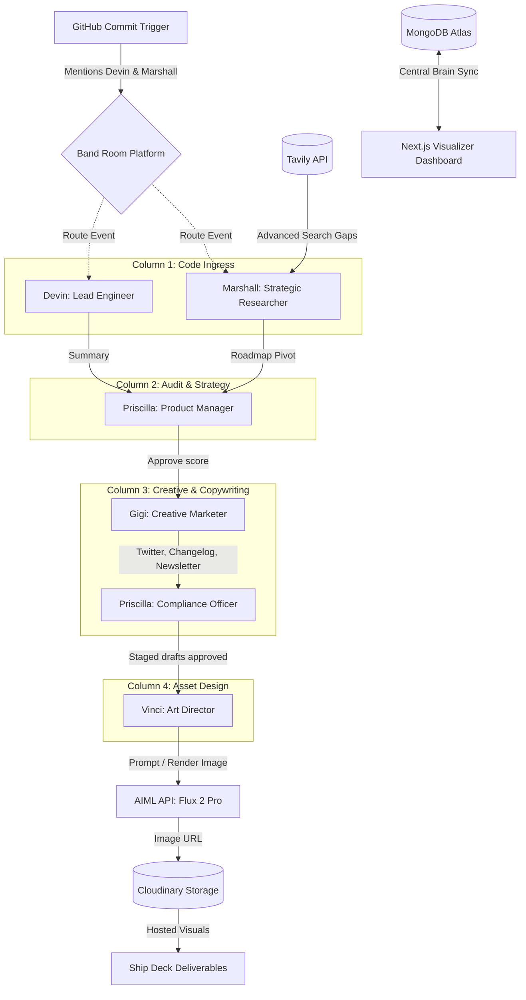

# 🚀 ShipStory: Autonomous Adversarial Multi-Agent Product Loop

ShipStory is a continuous adversarial alignment cycle designed for startups. Instead of running rigid, linear scripts, ShipStory orchestrates a network of autonomous agents that collaborate, review, debate, and design campaign deliverables the moment code is pushed.

---

## 🏗️ Architecture & Interaction Diagram



---

## 🤖 The Multi-Agent Network (Band Platform Agents)

Each agent in ShipStory runs as an isolated daemon. They communicate through **Band.ai** (a WebSockets-based agent platform room). When one agent completes its task, it sends a targeted platform mention in the room to trigger the next step.

| Agent | Module / Entrypoint | Platform Handle | Core Goal & Action |
| :--- | :--- | :--- | :--- |
| **Connie** | [connie_assistant](file:///c:/Users/User/OneDrive/Desktop/projects/shipstory/agents/connie_assistant/agent.py) | `@vicdevman/connie` | **Chief of Staff**: Answers operator queries using milestones in MongoDB. |
| **Devin** | [devin_eng](file:///c:/Users/User/OneDrive/Desktop/projects/shipstory/agents/devin_eng/agent.py) | `@vicdevman/devin` | **Lead Engineer**: Translates commit diffs and codebases into value statements. |
| **Marshall** | [marshall_research](file:///c:/Users/User/OneDrive/Desktop/projects/shipstory/agents/marshall_research/agent.py) | `@vicdevman/marshall` | **Researcher**: Queries competitor gaps via Tavily and logs strategic pivots. |
| **Priscilla** | [priscilla_product](file:///c:/Users/User/OneDrive/Desktop/projects/shipstory/agents/priscilla_product/agent.py) | `@vicdevman/priscilla` | **Product Manager**: Grades engineering scores and audits campaign copy drafts. |
| **Gigi** | [gigi_marketing](file:///c:/Users/User/OneDrive/Desktop/projects/shipstory/agents/gigi_marketing/agent.py) | `@vicdevman/gigi` | **Copywriter**: Writes multi-channel staged copy drafts (max 2 emojis safety limit). |
| **Vinci** | [vinci_design](file:///c:/Users/User/OneDrive/Desktop/projects/shipstory/agents/vinci_design/agent.py) | `@vicdevman/vinci` | **Art Director**: Generates visual design prompts and renders graphic assets. |

---

## 🎨 Tech Stack & Integrations

1. **Agent Orchestration**: **Band.ai Platform SDK & CrewAI**
2. **Web Frontend**: **Next.js 15, React Flow (@xyflow/react), Tailwind CSS, Lucide icons**
3. **Database & Cache**: **MongoDB Atlas & Mongoose** (centralized brain document mapping `_id: "nexus_labs_brain"`)
4. **Competitor Scans**: **Tavily AI Search API** (utilizing `"search_depth": "advanced"` and `"include_answer": True`)
5. **Asset Persistance**: **Cloudinary** & **AIML API (Flux 2 Pro image generation model)**

---

## 🛠️ Verification & Setup Guide

### Prerequisites
Make sure you have `pnpm` (Node) and `uv` (Python) installed on your system.

### 1. Environment & Config Templates
ShipStory is driven by two configuration layers. We have provided templates for both:
- **Agents Environment**: Copy [agents/.env.example](file:///c:/Users/User/OneDrive/Desktop/projects/shipstory/agents/.env.example) to `.env` and fill in your Band API Keys, LLM Model Providers, MongoDB Atlas URI, and Cloudinary storage endpoints.
- **Agent Identity Registry**: Copy [agents/agent_config.yaml.example](file:///c:/Users/User/OneDrive/Desktop/projects/shipstory/agents/agent_config.yaml.example) to `agent_config.yaml` and enter the agent UUIDs and Band platform developer keys.
- **Web App Settings**: Copy [apps/web/.env.example](file:///c:/Users/User/OneDrive/Desktop/projects/shipstory/apps/web/.env.example) to `.env.local` and configure MongoDB connections.

### 2. Install Dependencies
Install Node packages for the frontend workspace and build the application:
```bash
# Install frontend web dependencies
pnpm install

# Build the web assets to verify type completeness and optimize bundles
pnpm run build:web
```

### 3. Run the Entire System

To start the ShipStory war room, spin up the web dashboard and launch the platform agents.

**Step A: Launch the Next.js Visualizer Dashboard**
```bash
pnpm run dev:web
# Launches on http://localhost:3000
```

**Step B: Launch All 6 Platform Agents Concurrently**
We have written a unified runner script to start all agent processes under a single terminal:
```bash
cd agents
uv run python run_agents.py
```

---

## ⚓ Workspace Onboarding & GitHub Webhook Tracking

Instead of hardcoding a single repository, ShipStory operates a dynamic **Project Workspace**:
1. Click **"Open Workspace"** in the top right of the dashboard.
2. In the **Workspace Settings** tab, input your company details and connect multiple repositories (e.g. your backend, webapp, or mobile codebases). Mark one as the Primary codebase.
3. Configure a GitHub Webhook pointing to your deployed Next.js `/api/webhook` endpoint:
   - **Payload URL**: `https://your-domain.com/api/webhook`
   - **Content type**: `application/json`
   - **Events**: Just `push` events.
4. **Trigger Mechanism**: Whenever a push is made to the `main` or `master` branch of **any connected repository**, the webhook parses the payload. If the repository matches a connected codebase, it launches the multi-agent war room:
   - Devin parses the diff and summarizes the changes.
   - Marshall scans Tavily for competitors and logs strategic roadmap advice.
   - Gigi drafts tweets, changelogs, and newsletters matching the company guidelines.
   - Priscilla verifies compliance, and Vinci generates mockup assets.
   - Connie monitors the room as Chief of Staff to answer questions.

---

## 🧠 Key Workflow States

1. **Ingress (Start)**: A push to `main` on a connected codebase triggers `/api/webhook`, launching the analysis.
2. **Parallel Debate**: Devin summarizes code changes while Marshall runs a Tavily competitor search to log strategic recommendations.
3. **Drafting**: Gigi drafts marketing posts. Priscilla audits for emoji limits (rejecting >2 emojis).
4. **Design rendering**: Vinci turns approved copy into a design blueprint, generates an image using Flux 2 Pro, and uploads it to Cloudinary.
5. **Human Ship Control**: Staged posts and generated visual assets render on the frontend for approval and deployment.
